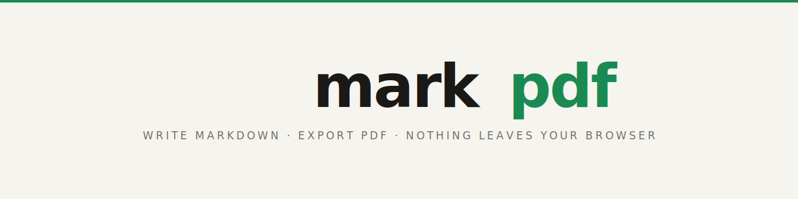

<!-- Hero -->
<p align="center">
  <picture>
    <source media="(prefers-color-scheme: dark)" srcset="./assets/banner-dark.svg" />
    
  </picture>
</p>

<p align="center">
  <a href="https://pws-wobbuffet.github.io/markpdf/"></a>
  
  <a href="./LICENSE"></a>
</p>

<p align="center"><b>Write Markdown. Export PDF. Nothing leaves your browser.</b></p>

<br />

## What it does

- Full-featured Markdown editor with syntax highlighting (CodeMirror 6)
- Live rendered preview, side-by-side
- One-click PDF export via browser print
- Multiple documents saved in `localStorage` — no server, no account
- Light & dark themes, accent colour picker, adjustable preview density

<br />

## Why

Your notes, drafts, and documents are nobody's business but yours. markpdf renders everything in the browser — there's no backend to send your text to, nothing logged, nothing stored anywhere but your own machine. Close the tab and it's gone; your documents live in `localStorage`, never on a server.

<br />

## Run locally

```bash
git clone https://github.com/pws-wobbuffet/markpdf.git
cd markpdf
pnpm install
pnpm dev
# open http://localhost:4321/markpdf/
```

```bash
pnpm build     # static export → ./dist
pnpm preview   # serve the build locally
```

<br />

## Stack

| | |
|---|---|
| **Astro** + **React** | static shell · interactive islands |
| **CodeMirror 6** | editor with Markdown syntax highlighting |
| **marked** | Markdown → HTML parser |
| **`window.print()`** | PDF export, entirely client-side |

No backend. No database. No analytics. Just static files.

<br />

## Contributing

PRs welcome — themes, export options, and editor niceties especially.

```
editor          →  src/components/Editor.jsx
print styles    →  src/styles/preview.css
bug reports     →  github.com/pws-wobbuffet/markpdf/issues
```

<br />

## License

[MIT](./LICENSE) — do whatever, just don't sue us.

<br />

---

<p align="center"><sub>Made for humans · Pairs nicely with <a href="https://pws-wobbuffet.github.io/privqr/"><b>privqr</b></a> &amp; <a href="https://pws-wobbuffet.github.io/peerdraw/"><b>peerdraw</b></a> · No servers harmed.</sub></p>
